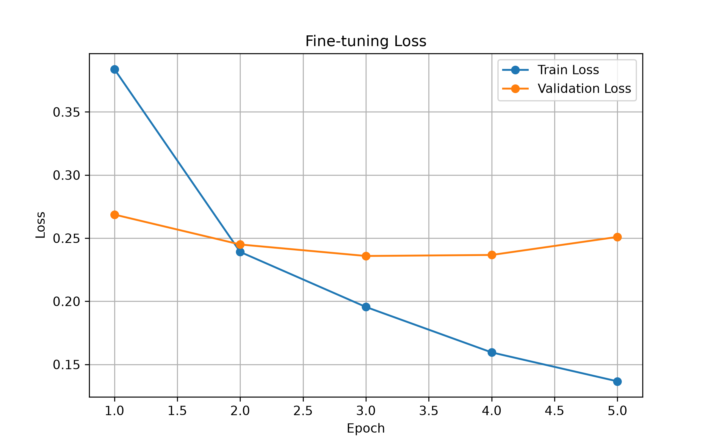
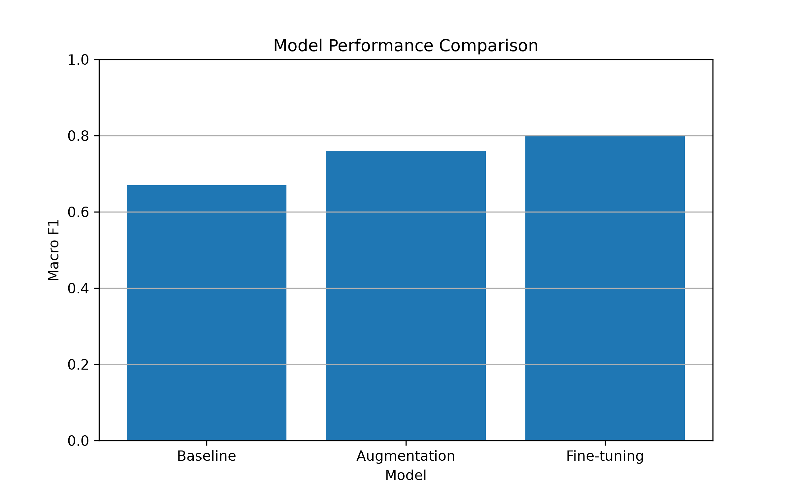

# 🚗 Car Damage Classification

## Parnoosh Mansouri

**Deep Learning • Computer Vision • PyTorch • Transfer Learning**

A deep learning project for **multi-label car damage classification** using PyTorch and Transfer Learning with ResNet18.

---

## 📌 Project Overview

This project focuses on detecting multiple types of car damage from a single image.

The model can identify six types of damage:

* Dent
* Scratch
* Crack
* Glass Shatter
* Lamp Broken
* Tire Flat

The project was completed in two phases: a baseline model followed by model improvement using augmentation, fine-tuning, and class-specific thresholds.

---

## 🧠 Phase 1 — Baseline Model

The first phase included:

* Dataset selection and preparation
* Train, validation, and test split
* PyTorch dataset pipeline
* ResNet18 with pretrained ImageNet weights
* Multi-label classification
* Model training
* Precision, Recall, and F1-score evaluation
* Best model checkpoint saving

### Baseline Result

**Macro F1: ~0.67**

---

## 🚀 Phase 2 — Model Improvement

The baseline model was improved using:

* Data augmentation
* Fine-tuning
* Class-specific probability thresholds
* Best model checkpoint saving
* Prediction on unseen images
* Training and model comparison visualizations

---

## 📊 Dataset

The project uses the **CarDD (Car Damage Detection)** dataset.

### Dataset Statistics

| Split      | Images |
| ---------- | -----: |
| Train      |  2,816 |
| Validation |    810 |
| Test       |    374 |

### Damage Classes

```text
dent
scratch
crack
glass_shatter
lamp_broken
tire_flat
```

---

## 🏗️ Model

The project uses **ResNet18 pretrained on ImageNet**.

The original classification layer was replaced with a six-output fully connected layer.

Because one image can contain multiple types of damage, this project uses **multi-label classification**.

### Training Configuration

| Parameter         | Value                              |
| ----------------- | ---------------------------------- |
| Framework         | PyTorch                            |
| Architecture      | ResNet18                           |
| Learning Approach | Transfer Learning                  |
| Loss Function     | BCEWithLogitsLoss                  |
| Optimizer         | Adam                               |
| Image Size        | 224 × 224                          |
| Batch Size        | 32                                 |
| GPU               | NVIDIA GeForce RTX 5070 Laptop GPU |
| CUDA              | Enabled                            |

---

## 🖼️ Data Augmentation

Training images were augmented using:

* Random horizontal flipping
* Random rotation
* Color jitter

Validation images were resized and normalized without random augmentation.

---

## 🔧 Fine-tuning

During fine-tuning, the final layers of ResNet18 were unfrozen and trained with a smaller learning rate.

This allowed the pretrained model to adapt its learned features to car damage patterns.

---

## 🎯 Class-Specific Thresholds

Because this is a multi-label classification problem, a separate probability threshold was optimized for each damage class using the validation set.

| Damage Type   | Threshold |
| ------------- | --------: |
| Dent          |      0.35 |
| Scratch       |      0.45 |
| Crack         |      0.20 |
| Glass Shatter |      0.50 |
| Lamp Broken   |      0.30 |
| Tire Flat     |      0.35 |

---

## 🏆 Results

The model improved throughout the development process:

| Model                           | Macro F1 |
| ------------------------------- | -------: |
| Baseline                        |    ~0.67 |
| Augmentation + Threshold Tuning |     0.76 |
| Fine-tuning + Threshold Tuning  | **0.80** |

### Final Classification Report

| Damage Type       | Precision |   Recall | F1-score |
| ----------------- | --------: | -------: | -------: |
| Dent              |      0.76 |     0.82 |     0.79 |
| Scratch           |      0.74 |     0.91 |     0.82 |
| Crack             |      0.52 |     0.66 |     0.58 |
| Glass Shatter     |      1.00 |     0.97 | **0.98** |
| Lamp Broken       |      0.69 |     0.83 |     0.75 |
| Tire Flat         |      0.96 |     0.85 | **0.90** |
| **Macro Average** |  **0.78** | **0.84** | **0.80** |

The strongest performance was achieved on **glass shatter** and **tire flat**.

The most challenging class was **crack**.

---

## 📈 Results Visualization

### Fine-tuning Loss



### Model Performance Comparison



---

## 🔮 Prediction

The project includes a prediction script for testing the trained model on new images.

Run:

```bash
python src/predict.py path/to/image.jpg
```

Example:

```bash
python src/predict.py test_images/car1.jpg
```

Example output:

```text
Prediction:

dent            98.02%
scratch         96.46%
crack           74.75%
lamp_broken     52.48%
```

The prediction script uses the optimized class-specific thresholds.

---

## 📁 Project Structure

```text
car-damage-classification/
│
├── data/
│   ├── train.csv
│   ├── val.csv
│   └── test.csv
│
├── dataset/
│   └── CarDD_COCO/
│
├── results/
│   ├── loss_curve.png
│   └── model_comparison.png
│
├── src/
│   ├── dataset.py
│   ├── dataset_augmented.py
│   ├── model.py
│   ├── test_model.py
│   ├── train.py
│   ├── train_augmented.py
│   ├── train_finetune.py
│   ├── predict.py
│   ├── tune_threshold_augmented.py
│   ├── evaluate_augmented.py
│   ├── tune_threshold_finetuned.py
│   └── evaluate_finetuned.py
│
├── .gitignore
└── README.md
```

---

## ⚙️ Requirements

* Python 3.12+
* PyTorch
* Torchvision
* NumPy
* Pandas
* Scikit-learn
* Pillow
* Matplotlib

Install the required packages:

```bash
pip install torch torchvision pandas numpy scikit-learn pillow matplotlib
```

---

## 💻 Hardware

Training was performed using:

**GPU:** NVIDIA GeForce RTX 5070 Laptop GPU

**CUDA:** Enabled

The project automatically selects CUDA when available:

```python
device = torch.device(
    "cuda" if torch.cuda.is_available() else "cpu"
)
```

---

## 👩‍💻 Author

**Parnoosh Mansouri**

Deep Learning & Computer Vision Project

---

## 📄 License

This project is intended for educational and research purposes.
