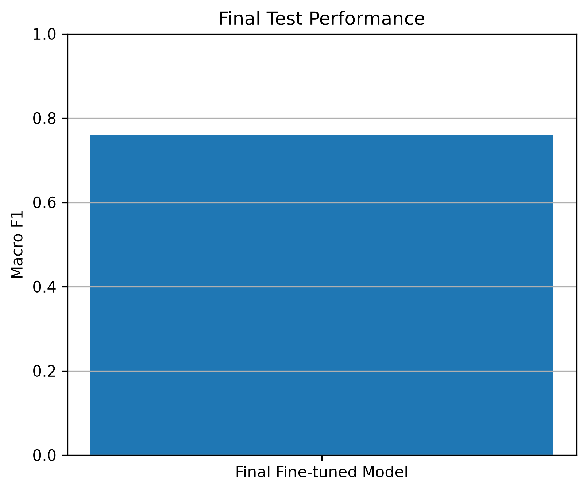

# 🚗 Car Damage Classification

## Parnoosh Mansouri

**Deep Learning • Computer Vision • PyTorch • Transfer Learning**

A deep learning project for **multi-label car damage classification** using PyTorch and Transfer Learning with ResNet18.

---

## 📌 Project Overview

This project focuses on detecting multiple types of car damage from a single image.

The model can identify six types of damage:

* Dent
* Scratch
* Crack
* Glass Shatter
* Lamp Broken
* Tire Flat

The project was developed in two phases: a baseline model followed by model improvement using data augmentation, fine-tuning, class-specific threshold tuning, and evaluation on an unseen test set.

---

## 🧠 Phase 1 — Baseline Model

The first phase included:

* Dataset selection and preparation
* Train, validation, and test split
* PyTorch dataset pipeline
* ResNet18 with pretrained ImageNet weights
* Multi-label classification
* Model training
* Precision, Recall, and F1-score evaluation
* Best model checkpoint saving

---

## 🚀 Phase 2 — Model Improvement

The baseline model was improved using:

* Data augmentation
* Fine-tuning
* Class-specific probability thresholds
* Best model checkpoint saving
* Prediction on new images
* Training and evaluation visualizations
* Final evaluation on the unseen test set

---

## 📦 Dataset

This project uses the **Car Damage Detection (CarDD)** dataset.

### Download

The dataset can be downloaded from Kaggle:

**[Car Damage Detection — Kaggle](https://www.kaggle.com/datasets/nasimetemadi/car-damage-detection)**

After downloading the dataset, extract the image files into:

```text
dataset/
└── CarDD_COCO/
    ├── train2017/
    ├── val2017/
    └── test2017/
```

The dataset split CSV files are already included in this repository:

```text
data/
├── train.csv
├── val.csv
└── test.csv
```

Therefore, after cloning the repository, the only additional step required is downloading the CarDD image dataset from Kaggle and placing it in the expected directory.

### Dataset Statistics

| Split      | Images |
| ---------- | -----: |
| Train      |  2,816 |
| Validation |    810 |
| Test       |    374 |

### Damage Classes

```text
dent
scratch
crack
glass_shatter
lamp_broken
tire_flat
```

---

## 🏗️ Model

The project uses **ResNet18 pretrained on ImageNet**.

The original classification layer was replaced with a six-output fully connected layer.

Because one image can contain multiple types of damage, this project uses **multi-label classification**.

### Training Configuration

| Parameter         | Value                              |
| ----------------- | ---------------------------------- |
| Framework         | PyTorch                            |
| Architecture      | ResNet18                           |
| Learning Approach | Transfer Learning                  |
| Loss Function     | BCEWithLogitsLoss                  |
| Optimizer         | Adam                               |
| Image Size        | 224 × 224                          |
| Batch Size        | 32                                 |
| GPU               | NVIDIA GeForce RTX 5070 Laptop GPU |
| CUDA              | Enabled                            |

---

## 🖼️ Data Augmentation

Training images were augmented using:

* Random horizontal flipping
* Random rotation
* Color jitter

Validation and test images were resized and normalized without random augmentation.

---

## 🔧 Fine-tuning

During fine-tuning, the final layers of ResNet18 were unfrozen and trained with a smaller learning rate.

This allowed the pretrained model to adapt its learned features to car damage patterns.

---

## 🎯 Class-Specific Thresholds

Since this is a multi-label classification problem, a separate probability threshold was selected for each damage class.

Thresholds were optimized **only using the validation set**.

The final thresholds were:

| Damage Type   | Validation Threshold |
| ------------- | -------------------: |
| Dent          |                 0.35 |
| Scratch       |                 0.45 |
| Crack         |                 0.20 |
| Glass Shatter |                 0.50 |
| Lamp Broken   |                 0.30 |
| Tire Flat     |                 0.35 |

These thresholds were then kept fixed and used for the final evaluation on the unseen test set.

The test set was **not used for threshold selection**.

---

## 🏆 Final Test Results

The final model was evaluated on the **unseen test set** using the fixed thresholds selected from the validation set.

### Final Test Macro F1: **0.76**

| Damage Type          | Precision |   Recall | F1-score | Support |
| -------------------- | --------: | -------: | -------: | ------: |
| Dent                 |      0.72 |     0.87 |     0.79 |     157 |
| Scratch              |      0.71 |     0.92 |     0.80 |     183 |
| Crack                |      0.41 |     0.58 |     0.48 |      48 |
| Glass Shatter        |      0.98 |     0.82 |     0.89 |      71 |
| Lamp Broken          |      0.63 |     0.83 |     0.72 |      65 |
| Tire Flat            |      0.96 |     0.81 |     0.88 |      31 |
| **Macro Average**    |  **0.73** | **0.80** | **0.76** | **555** |
| **Weighted Average** |  **0.73** | **0.85** | **0.78** | **555** |

The strongest performance was achieved on **Scratch**, **Tire Flat**, and **Dent**.

The most challenging class was **Crack**, with an F1-score of 0.48.

---

## 📈 Results Visualization

### Fine-tuning Loss

The following plot shows the training and validation loss during fine-tuning.


### Final Test Performance

The final Macro F1 score on the unseen test set is **0.76**.



---

## 🔮 Prediction

The project includes a prediction script for testing the trained model on new images.

Run:

```bash
python src/predict.py path/to/image.jpg
```

Example:

```bash
python src/predict.py test_images/car1.jpg
```

Example output:

```text
Prediction:

dent            98.02%
scratch         96.46%
crack           74.75%
lamp_broken     52.48%
```

The prediction script uses the class-specific thresholds selected using the validation set.

---

## 📁 Project Structure

```text
car-damage-classification/
│
├── data/
│   ├── train.csv
│   ├── val.csv
│   └── test.csv
│
├── dataset/
│   └── CarDD_COCO/
│       ├── train2017/
│       ├── val2017/
│       └── test2017/
│
├── results/
│   ├── loss_curve.png
│   └── final_test_f1.png
│
├── src/
│   ├── dataset.py
│   ├── dataset_augmented.py
│   ├── model.py
│   ├── test_model.py
│   ├── train.py
│   ├── train_augmented.py
│   ├── train_finetune.py
│   ├── predict.py
│   ├── plot_results.py
│   ├── evaluate_augmented.py
│   ├── evaluate_finetuned.py
│   ├── evaluate_test.py
│   ├── tune_threshold_augmented.py
│   └── tune_threshold_finetuned.py
│
├── .gitignore
├── README.md
└── requirements.txt
```

---

## ⚙️ Requirements

* Python 3.12+
* PyTorch
* Torchvision
* NumPy
* Pandas
* Scikit-learn
* Pillow
* Matplotlib

The project dependencies and tested versions are listed in `requirements.txt`.

Install them with:

```bash
pip install -r requirements.txt
```

### Tested Environment

```text
torch==2.13.0+cu132
torchvision==0.28.0+cu132
numpy==2.5.2
pandas==3.0.5
scikit-learn==1.9.0
Pillow==12.3.0
matplotlib==3.11.1
```

---

## 💻 Hardware

Training was performed using:

**GPU:** NVIDIA GeForce RTX 5070 Laptop GPU

**CUDA:** Enabled

The project automatically selects CUDA when available:

```python
device = torch.device(
    "cuda" if torch.cuda.is_available() else "cpu"
)
```

---

## ▶️ Running the Project

After cloning the repository:

### 1. Install dependencies

```bash
pip install -r requirements.txt
```

### 2. Download the CarDD dataset

Download the dataset from:

**[Car Damage Detection — Kaggle](https://www.kaggle.com/datasets/nasimetemadi/car-damage-detection)**

Extract the image dataset into:

```text
dataset/CarDD_COCO/
```

### 3. Train the baseline model

```bash
python src/train.py
```

### 4. Train with augmentation

```bash
python src/train_augmented.py
```

### 5. Fine-tune the model

```bash
python src/train_finetune.py
```

### 6. Find validation thresholds

```bash
python src/tune_threshold_finetuned.py
```

### 7. Evaluate on the unseen test set

```bash
python src/evaluate_test.py
```

### 8. Generate result plots

```bash
python src/plot_results.py
```

### 9. Predict a new image

```bash
python src/predict.py path/to/image.jpg
```

---

## 👩‍💻 Author

**Parnoosh Mansouri**

Deep Learning & Computer Vision Project

---

## 📄 License

This project is intended for educational and research purposes.
